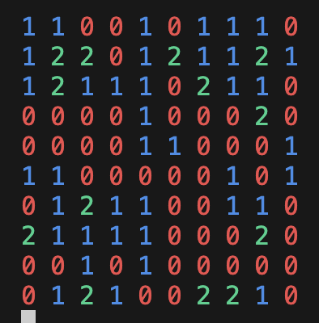

# Game of Life



## Assignment

Consider a representation of a "world" as an n by n matrix. Each element in the matrix may contain 1 organism. Each organism lives, dies and reproduces according to the following set of rules:

1. If there are two or three organisms of the same type living in the elements surrounding an organism of the same, type then it may survive.
2. If there are less than two organisms of one type surrounding one of the same type then it will die due to isolation.
3. If there are four or more organisms of one type surrounding one of the same type then it will die due to overcrowding.
4. If there are exactly three organisms of one type surrounding one element, they may give birth into that cell. The new organism is the
   same type as its parents.
5. If this condition is true for more than one
   species on the same element then species type for the new element is chosen randomly.

### Running the Application

```
cd GameOfLife
dotnet run
```

### Running the Tests

```
cd GameOfLifeTest
dotnet test
```
